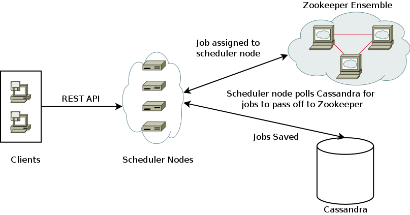

=========
Scheduler
=========

:Date: 2014-1-29
:Author: Jonathan Inloes
:Version: 0.2
:Updated: 2014-03-27

Use Case
--------

We need a service that will schedule jobs to be executed at a provided date. The scheduler is
application agnostic in the sense that it does not know who is scheduling jobs. Currently,
the scheduler only supports running jobs that interact with a REST interface.

Requirements
------------

- Zookeeper_ ensemble
- Cassandra_ cluster

Architecture
------------

The system is separated into an executor and storage tier. The executor tier uses a distributed
queue_ implemented in Zookeeper_ that guarantees a consume will receive and process a message. The
data tier uses Cassandra_ as a distributed database that guarantees there will be no single point of
failure for retrieving data.

One scheduler node is `leader elected`_ to be the master node that polls Cassandra_ at time
intervals check for jobs ready to be run. If this master node fails, then another node will be
elected as the leader to poll Cassandra_. This guarantees that unless total Zookeeper or Scheduler
failure there will always be a scheduler that queues jobs to be executed.

When a job is placed in the distributed queue managed by Zookeeper_, one scheduler node will be
guaranteed to receive the job. If a scheduler node fails while processing a job, then the job will
be assigned to another scheduler node.

Typical Flow
------------

#. API request to schedule migration is made (Client)
#. API POSTs the migration job to the scheduler
#. Scheduler receives the job and saves it in Cassandra
#. Scheduler `leader elected`_ task finds a job to execute and adds the job to the queue
#. Scheduler queue consumer receives the job and executes the job

Fault Tolerance
---------------

- Cassandra data center crashes
    - Unless complete failure, the scheduler would switch to one of the other Cassandra data centers to queue up jobs
    - Data is also preserved if ALL the centers were to simultaneously crash
- A scheduler node crashes
    - Unless complete failure, a new node will be leader elected and take control of job selection tasks
    - Nodes that crash while executing a job would have the job reassigned to another node through Zookeeper
- Zookeeper node crashes
    - Unless completele failure, scheduler would failover to another working Zookeeper node
    - Currently executing jobs would finish normally, however in complete failure, no new jobs could be executed

Bootstrapping
-------------

Execute `CQL script <misc/cassandra/create_tables.cql>`_

How to run
----------

java -jar scheduler.jar -D<**System Property**>=<value>

Configuration
^^^^^^^^^^^^^

The following system properties can be specified

================================== ==================================================== ==============================
Parameter                          Description                                          Default
================================== ==================================================== ==============================
zookeeper.connect_url              Comma separated list of Zookeeper host:port pairs    localhost:2181
zookeeper.wait_time_ms             Milliseconds to wait for Zookeeper connection        100
zookeeper.sleep_between_retries_ms Milliseconds to wait between connection attempts     5
cassandra.hosts                    Comma separated list of Cassandra hosts              localhost
cassandra.port                     Cassandra port                                       9042
cassandra.keyspace                 Cassandra keyspace                                   scheduler
cassandra.poll.rate                Cassandra polling delay in seconds                   15
server.port                        `Spring Boot`_ setting, container port               8080
scheduler.api.username             API Scheduler username                               scheduler-user@rivermeadow.com
scheduler.api.password             API Scheduler user password                          scheduler
                                   Note: This should be different for every environment
================================== ==================================================== ==============================

REST API
--------

Schedule a job
^^^^^^^^^^^^^^
POST Request::

    POST /api/v1/jobs
    {
        "task": {
            "method": "POST",
            "uri": "http://www.myserver.com",
            "body": {
                ...
            },
            "response_code_ranges": [
                {
                    "start": 200,
                    "end": 300
                }
            ]
        },
        "schedule": "2014-01-24T12:28:27-08:00"
    }

POST Response::

    {
        "id": <uuid>,
        "link": "/api/v1/jobs/<uuid>"
    }

Request Params
^^^^^^^^^^^^^^

The following request params are supported by the POST /api/v1/jobs endpoint:

================================== ======== ===================================================================
Param Path                         Required Notes
================================== ======== ===================================================================
schedule                           Yes      `ISO 8601`_ datetime string or value 'now' that tells the scheduler
                                            when the job should be run.
task                               Yes      Task object that contains information about the job being
                                            executed.
task.method                        Yes      Request method to perform. ie. GET, PUT, POST, DELETE
task.uri                           Yes      Uri execute request upon. The scheme is required. Currently,
                                            only the http scheme is supported.
task.body                          Yes      Request body to send.
task.response_code_ranges          No       A list of expected response code ranges. If no value is provided,
                                            then no restriction will be placed on the response code.
task.response_code_ranges[*].start No       Inclusive expected response code range start. If no value is
                                            provided, then minimum integer value will be assumed. If **start**
                                            is greater than **end**, then **start* will be assumed to be the
                                            end.
task.response_code_ranges[*].end   No       Inclusive expected response code range end. If no value is
                                            provided, then maximum integer value will be assumed. If **end**
                                            is less than **start**, then **end** will be assumed to be the
                                            **start**.
================================== ======== ===================================================================

Validation Error Response
^^^^^^^^^^^^^^^^^^^^^^^^^
If validation fails on a job post, then the response will be::

    Code: 406
    {
        "errors": [
            {
                "field": <field name ie. "task.uri">,
                "message": <error message ie. "Invalid date.">
            }
        ]
    }

where **field name** is the name of the field that contained the error and **message** is the validation error message

Retrieve a job
^^^^^^^^^^^^^^

GET Request::

    GET /api/v1/jobs/{jobId}

GET Response::

    {
        "id": <uuid>,
        "task": {
            "method": "POST",
            "uri": "http://www.myserver.com",
            "body": {
                #Job request body
            },
            "response_code_ranges": [
                {
                    "start": 200,
                    "end": 300
                }
            ]
        },
        "schedule": "2014-01-24T12:28:27-08:00"
    }

Error Messages
^^^^^^^^^^^^^^

Error messages outside of validation will be returned in the following format::

    {
        "message": <error message>
    }

Common Response Codes
^^^^^^^^^^^^^^^^^^^^^
    * 201 - Job successfully queued
    * 406 - Request body validation failed, check the **errors** field for field/error message pair
    * 500 - Unexpected error has occurred, check the **message** field for error message

.. Links:

.. _Zookeeper: http://zookeeper.apache.org/
.. _Cassandra: http://cassandra.apache.org/
.. _ISO 8601: http://en.wikipedia.org/wiki/ISO_8601
.. _leader elected: http://curator.apache.org/curator-recipes/leader-election.html
.. _queue: http://curator.apache.org/curator-recipes/distributed-queue.html
.. _Spring Boot: http://projects.spring.io/spring-boot/
